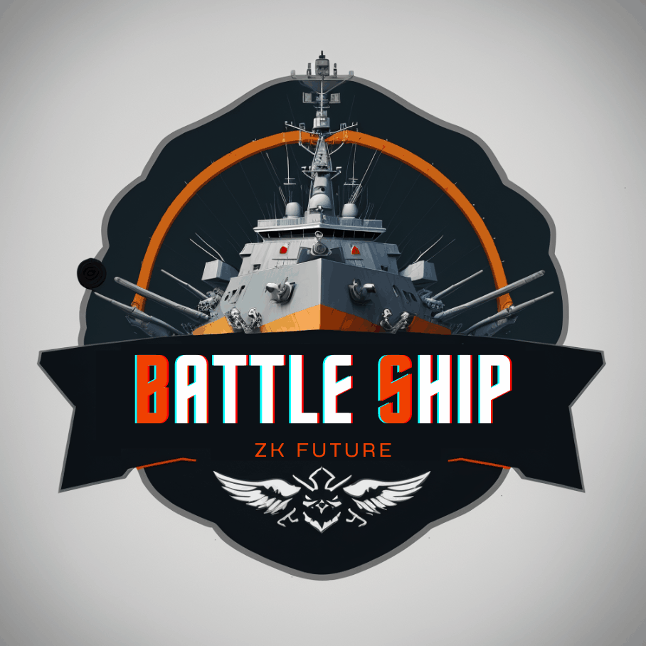

## 基本资料

项目名称：Future Tool - zkFuture - Battleship

项目立项日期：2023-06

## 项目整体简介

零知识证明将是未来Web3.0的基石，它利用神奇的密码学原理做到了保护隐私和压缩数据的能力，但其编程复杂，效率低，如何用好这一工具将是广大开发者的难题。

本工具主要提供零知识证明的基础开发工具，不过鉴于黑客松的时间范围缘故，本项目将以一个简单的battleship舰艇对战游戏为例，演示开发工具的能力和效果。

battleship舰艇对战游戏是一种双人游戏，每个玩家都有一张NxM的网格，玩家需要在自己的网格上放置一些战舰。战舰可以是1到10格长，可以水平或垂直放置，但不能重叠。一旦战舰放置完成，玩家轮流猜测对方的战舰位置。每次猜测时，玩家需要指定一个网格坐标，如果该坐标上有对方的战舰，则该战舰被击中，否则就是未击中。当一艘战舰的所有格子都被击中时，该战舰被击沉。游戏继续进行，直到一方玩家的所有战舰都被击沉为止，那么另一方玩家就获胜了。

[项目Demo](docs/demo.md)

[项目Demo视频](https://www.editool.cn/zkFuture.mp4)

## 技术架构

- `ui/` 界面相关的代码，并包含zk证明及合约交互的代码
- `src/circuits/` 电路代码
- `src/contracts/` 合约代码
- `scripts` 一些辅助脚本代码

## 游戏逻辑

由其中一个玩家开启游戏，另外一个玩家使用同样的ID号加入游戏。能顺利加入游戏的必要条件就是通过BoardEligibility的零知识电路的检查。

```mermaid
flowchart LR
    create["Create(UI)"]
    join["Join(UI)"]

    game["Game(.sol)"]
    board["BoardEligibility(.sol)"]

    create --> game --> board
    join --> game
```

游戏创建后，每个玩家依次进行轮回的游戏，直到有一方胜利为止

```mermaid
flowchart LR
    turn["Turn(UI)"]

    game["Game(.sol)"]
    attack["RevealAttack(.sol)"]

    turn --> game --> attack
```

## 程序部署说明

1. 准备$\tau$：`yarn setup:ptau`
2. 编译零知识电路：`build:circuits`
3. 【可选步骤】当合约发生变化后，重新编译强类型文件：`build:contracts`
4. 部署合约：`deploy:contracts`
5. 将上一步中部署的合约放到UI中进行调用

## 本项目的起点

- https://github.com/CDDelta/battleship3 zk电路设计主要使用该项目的设计方案
- https://github.com/BattleZips/BattleZips-Circom zk电路设计也参考了该项目的方案
- https://github.com/BattleZips/battlezip-frontend 前端设计方案参考了该项目，并从该项目中借了船的图片
- Stable Diffusion + A RPG Artist(Model) LOGO使用该工具生成

## 黑客松期间计划完成的事项

**区块链端**

- 合约模板
  - [x] 创建新游戏 (`fn create()`)
  - [x] 加入游戏 (`fn join()`)
  - [x] 发起攻击 (`fn turn()`)
  - [ ] 游戏结算 (`fn closeup()`)

- 合约生成工具：根据算术电路生成合约
  - [x] 电路编译生成的命令行
  - [x] 验证参数的生成
  - [x] 根据定义生成接口
  - [x] 集成与部署功能

**客户端**

- web 端
  - [x] 创建新的游戏
  - [x] 加入游戏
  - [x] 发起攻击
  - [ ] 游戏结算

## 队员信息

- [Icer](https://github.com/wizicer) - Full-Stack Developer - WeChat: wxid_wf3w33euagf622